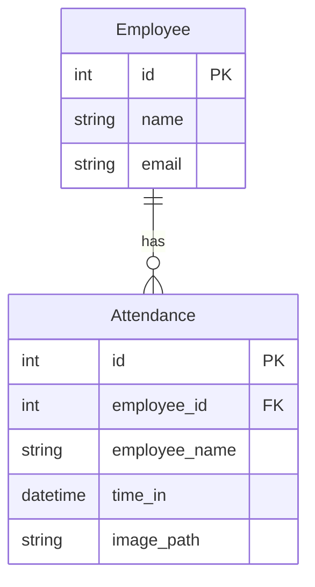

# Face Recognition Attendance System – Backend Documentation

This backend powers a facial recognition-based employee attendance system using FastAPI, SQLAlchemy, and state-of-the-art face detection and recognition models. It exposes HTTP APIs, database utilities, and model-driven face processing pipelines.

---

## 🗂️ File & Module Overview

| File/Folder              | Purpose                                                                                     |
|------------------------- |--------------------------------------------------------------------------------------------|
| `main.py`                | FastAPI application entrypoint and API router inclusion.                                   |
| `models.py`              | SQLAlchemy ORM models for Employees and Attendance.                                        |
| `schema.py`              | Pydantic schemas for API validation and serialization.                                     |
| `crud.py`                | CRUD functions for Employee and Attendance database interactions.                          |
| `database.py`            | Database connection setup, session factory, and dependency.                                |
| `attendance.py`          | Attendance API endpoints (create, read, delete, stats).                                    |
| `employees.py`           | Employee management API (create, list, get-by-ID).                                         |
| `recognize.py`           | Face recognition API endpoint.                                                             |
| `generate_embeddings.py` | Script to generate and save face embeddings from a dataset using deep models.              |
| `process_in_place.py`    | Utility for in-place image preprocessing across datasets.                                  |
| `preprocessing.py`       | Image enhancement functions (CLAHE, gamma, denoise, sharpen, etc.).                        |
| `detection.py`           | Face detection using YOLOv8.                                                               |
| `utils.py`               | Image I/O and face preprocessing utilities.                                                |
| `super_resolution.py`    | Super-resolution model wrapper for image upscaling.                                        |
| `simple_recognition.py`  | Lightweight face embedding extraction (for simple/fast use cases).                         |
| `fix_dataset_faces.py`   | Cleans and crops all faces in the dataset for uniformity and quality.                      |
| `webcam_client.py`       | Command-line webcam client for real-time recognition and user dataset expansion.           |
| `create_db.py`           | Script to (re)create and initialize the database schema.                                   |
| `requirements.txt`       | Python dependencies required for backend operation.                                        |
| `.env`                   | Stores DB credentials and environment variables.                                           |
| `.python-version`        | Python version lock file.                                                                  |
| `README.md`              | Main documentation file.                                                                   |

---

## 🚀 FastAPI Application (`main.py`)

The backend launches a FastAPI app, exposes RESTful APIs, and enables CORS for local frontend access.

```python
from fastapi import FastAPI

app = FastAPI(
    title="Face Recognition Attendance System",
    description="An API to manage attendance using facial recognition.",
    version="1.0.0"
)
# Routers: employees, attendance, recognize
```

### Root Endpoint

```api
{
    "title": "Welcome Message",
    "description": "Returns a welcome message for API health check.",
    "method": "GET",
    "baseUrl": "http://localhost:8000",
    "endpoint": "/",
    "headers": [],
    "bodyType": "none",
    "requestBody": "",
    "responses": {
        "200": {
            "description": "Welcome message",
            "body": "{\"message\": \"Welcome to the Attendance Management System\"}"
        }
    }
}
```

---

## 👤 Employee Management API (`employees.py`)

Handles employee creation, retrieval, and listing.

### Create Employee

```api
{
    "title": "Create Employee",
    "description": "Registers a new employee by name and email.",
    "method": "POST",
    "baseUrl": "http://localhost:8000",
    "endpoint": "/employees/",
    "headers": [
        {
            "key": "Content-Type",
            "value": "application/json",
            "required": true
        }
    ],
    "bodyType": "json",
    "requestBody": "{ \"name\": \"Alice Smith\", \"email\": \"alice@example.com\" }",
    "responses": {
        "201": {
            "description": "Employee created",
            "body": "{ \"id\": 1, \"name\": \"Alice Smith\", \"email\": \"alice@example.com\" }"
        },
        "400": {
            "description": "Duplicate email",
            "body": "{ \"detail\": \"Email already registered\" }"
        }
    }
}
```

### Get Employee by ID

```api
{
    "title": "Get Employee By ID",
    "description": "Retrieve employee details by unique ID.",
    "method": "GET",
    "baseUrl": "http://localhost:8000",
    "endpoint": "/employees/{employee_id}",
    "pathParams": [
        { "key": "employee_id", "value": "Employee's unique DB ID", "required": true }
    ],
    "bodyType": "none",
    "requestBody": "",
    "responses": {
        "200": {
            "description": "Employee found",
            "body": "{ \"id\": 1, \"name\": \"Alice Smith\", \"email\": \"alice@example.com\" }"
        },
        "404": {
            "description": "Not found",
            "body": "{ \"detail\": \"Employee not found\" }"
        }
    }
}
```

### List All Employees

```api
{
    "title": "List All Employees",
    "description": "Lists all employees in the system.",
    "method": "GET",
    "baseUrl": "http://localhost:8000",
    "endpoint": "/employees/",
    "bodyType": "none",
    "requestBody": "",
    "responses": {
        "200": {
            "description": "List of employees",
            "body": "[ { \"id\": 1, \"name\": \"Alice Smith\", \"email\": \"alice@example.com\" }, ... ]"
        }
    }
}
```

---

## 🕒 Attendance API (`attendance.py`)

Supports creating, querying, and deleting attendance records, with stats endpoints.

### Create Attendance Record

```api
{
    "title": "Create Attendance",
    "description": "Create a new attendance record for an employee (requires employee_id and image_path).",
    "method": "POST",
    "baseUrl": "http://localhost:8000",
    "endpoint": "/attendance/",
    "headers": [
        { "key": "Content-Type", "value": "application/json", "required": true }
    ],
    "bodyType": "json",
    "requestBody": "{ \"employee_id\": 1, \"image_path\": \"uploads/alice_20240612.jpg\" }",
    "responses": {
        "201": {
            "description": "Attendance record created",
            "body": "{ \"id\": 5, \"employee_id\": 1, \"image_path\": \"uploads/alice_20240612.jpg\", \"time_in\": \"2024-06-12T08:30:12\" }"
        },
        "404": {
            "description": "Employee not found",
            "body": "{ \"detail\": \"Employee with ID 1 not found\" }"
        }
    }
}
```

### Get Attendance by Date

```api
{
    "title": "Get Attendance by Date",
    "description": "Retrieves all attendance records for a given date (YYYY-MM-DD).",
    "method": "GET",
    "baseUrl": "http://localhost:8000",
    "endpoint": "/attendance/by-date/{date}",
    "pathParams": [
        { "key": "date", "value": "Date in YYYY-MM-DD", "required": true }
    ],
    "bodyType": "none",
    "requestBody": "",
    "responses": {
        "200": {
            "description": "Attendance records for date",
            "body": "[ { \"id\": 5, \"employee_id\": 1, \"employee_name\": \"Alice Smith\", \"image_path\": \"uploads/alice_20240612.jpg\", \"time_in\": \"2024-06-12T08:30:12\" } ]"
        },
        "400": {
            "description": "Invalid date format",
            "body": "{ \"detail\": \"Invalid date format. Use YYYY-MM-DD\" }"
        }
    }
}
```

### Get Today's Attendance

```api
{
    "title": "Get Today's Attendance",
    "description": "Lists all attendance records for the current day.",
    "method": "GET",
    "baseUrl": "http://localhost:8000",
    "endpoint": "/attendance/today",
    "bodyType": "none",
    "requestBody": "",
    "responses": {
        "200": {
            "description": "Today's attendance records",
            "body": "[ ... ]"
        }
    }
}
```

### Get Employee Attendance History

```api
{
    "title": "Get Employee Attendance History",
    "description": "Returns attendance records for a given employee, with optional date filtering and pagination.",
    "method": "GET",
    "baseUrl": "http://localhost:8000",
    "endpoint": "/attendance/employee/{employee_id}",
    "pathParams": [
        { "key": "employee_id", "value": "Employee's unique DB ID", "required": true }
    ],
    "queryParams": [
        { "key": "start_date", "value": "YYYY-MM-DD", "required": false },
        { "key": "end_date", "value": "YYYY-MM-DD", "required": false },
        { "key": "limit", "value": "Max records", "required": false },
        { "key": "skip", "value": "Records to skip", "required": false }
    ],
    "bodyType": "none",
    "requestBody": "",
    "responses": {
        "200": {
            "description": "Employee attendance records",
            "body": "[ ... ]"
        },
        "404": {
            "description": "Employee not found",
            "body": "{ \"detail\": \"Employee with ID 99 not found\" }"
        }
    }
}
```

### Get Monthly Attendance Stats

```api
{
    "title": "Get Monthly Attendance Stats",
    "description": "Returns statistics for a specific year and month, including total records and daily breakdown.",
    "method": "GET",
    "baseUrl": "http://localhost:8000",
    "endpoint": "/attendance/stats/monthly/{year}/{month}",
    "pathParams": [
        { "key": "year", "value": "Year", "required": true },
        { "key": "month", "value": "Month", "required": true }
    ],
    "bodyType": "none",
    "requestBody": "",
    "responses": {
        "200": {
            "description": "Monthly statistics",
            "body": "{ \"year\": 2024, \"month\": 6, \"total_attendance\": 15, \"unique_employees\": 3, \"daily_breakdown\": [ { \"date\": \"2024-06-12\", \"count\": 5 }, ... ] }"
        }
    }
}
```

### Delete Attendance Record

```api
{
    "title": "Delete Attendance Record",
    "description": "Deletes a specific attendance record by ID and returns the deleted record info.",
    "method": "DELETE",
    "baseUrl": "http://localhost:8000",
    "endpoint": "/attendance/{attendance_id}",
    "pathParams": [
        { "key": "attendance_id", "value": "Attendance record ID", "required": true }
    ],
    "bodyType": "none",
    "requestBody": "",
    "responses": {
        "200": {
            "description": "Record deleted",
            "body": "{ \"message\": \"Record successfully deleted\", \"deleted_record\": { ... } }"
        },
        "404": {
            "description": "Not found",
            "body": "{ \"detail\": \"Attendance record with ID 99 not found\" }"
        }
    }
}
```

---

## 🤳 Face Recognition API (`recognize.py`)

Recognizes an uploaded face image using deep learning models and FAISS nearest neighbor search.

### Recognize Face

```api
{
    "title": "Recognize Face",
    "description": "Detects and recognizes the person in the uploaded image.",
    "method": "POST",
    "baseUrl": "http://localhost:8000",
    "endpoint": "/recognize",
    "headers": [
        { "key": "Content-Type", "value": "multipart/form-data", "required": true }
    ],
    "formData": [
        { "key": "file", "value": "The image file (.jpg, .png)", "required": true }
    ],
    "bodyType": "form",
    "responses": {
        "200": {
            "description": "Recognition result",
            "body": "{ \"identity\": \"alice@example.com\", \"confidence\": 0.97 }"
        },
        "400": {
            "description": "No face detected",
            "body": "{ \"detail\": \"No face detected.\" }"
        }
    }
}
```

**Usage Example (Python):**

```python
import requests
with open("face.jpg", "rb") as f:
    resp = requests.post("http://localhost:8000/recognize", files={"file": f})
print(resp.json())
```

---

## 🏛 Database & ORM

### Models (`models.py`)

- **Employee**: id, name, email, attendances (relationship)
- **Attendance**: id, employee_id (FK), employee_name, time_in, image_path

### Schemas (`schema.py`)

- **EmployeeCreate/EmployeeResponse**: Used for employee creation and retrieval
- **AttendanceCreate/AttendanceResponse/Attendance**: Used for attendance creation/queries
- **MonthlyAttendanceStats**: Used for statistics endpoints

#### Entity Relationship Diagram



---

## 🧠 Face Recognition Pipeline

- **Face Detection**: `detection.py` uses YOLOv8 for robust face localization.
- **Face Preprocessing**: `preprocessing.py`, `utils.py` enhance and normalize faces.
- **Embedding Extraction**: `recognition.py`, `simple_recognition.py` use FaceNet (PyTorch) to extract 512-d embeddings.
- **Recognition**: Nearest neighbor search (FAISS) matches embeddings to known identities from `assets/embeddings.pkl`.

#### Data Flow

```mermaid
flowchart TD
    A[Uploaded Image] --> B[Face Detection (YOLOv8)]
    B -->|Face Found| C[Image Preprocessing]
    C --> D[Embedding Extraction (FaceNet)]
    D --> E[FAISS Search]
    E --> F[Prediction Identity + Confidence]
```

---

## 🛠️ Utilities & Scripts

- **`generate_embeddings.py`**: Generates `embeddings.pkl` from dataset images.
- **`fix_dataset_faces.py`**: Crops and preprocesses all faces in the dataset for uniformity.
- **`process_in_place.py`**: In-place enhancement and quality filtering of dataset images.
- **`super_resolution.py`**: Image upscaling for low-resolution faces.
- **`webcam_client.py`**: CLI tool for capturing images and registering new users interactively.

---

## ⚡ Setup & Usage

### 1. Install Dependencies

```bash
pip install -r requirements.txt
```

### 2. Configure Environment

- Edit `.env` to set your `DATABASE_URL`.

### 3. Initialize Database

```bash
python create_db.py
```

### 4. (Optional) Prepare Dataset & Generate Embeddings

```bash
python fix_dataset_faces.py
python generate_embeddings.py
```

### 5. Run Backend

```bash
uvicorn main:app --reload --host 0.0.0.0 --port 8000
```

---

## 🧪 Example API Usage

### Register a New Employee

```bash
curl -X POST http://localhost:8000/employees/ \
  -H "Content-Type: application/json" \
  -d '{"name": "Alice Smith", "email": "alice@example.com"}'
```

### Mark Attendance

```bash
curl -X POST http://localhost:8000/attendance/ \
  -H "Content-Type: application/json" \
  -d '{"employee_id": 1, "image_path": "uploads/alice_20240612.jpg"}'
```

### Recognize Face (Image Upload)

```bash
curl -X POST http://localhost:8000/recognize \
  -F 'file=@face.jpg'
```

---

## 📝 Notable Files & Assets

- `assets/class_labels.pkl`: Pickled mapping for class labels.
- `assets/embeddings.pkl`: Known face embeddings for recognition.
- `assets/yolov8n-face.pt`: YOLOv8 face detection weights.

---

## ⚠️ Best Practices

```card
{
    "title": "Model Files & Security",
    "content": "Never publish sensitive model weights or database credentials to version control. Use .env for secrets."
}
```

---

## 💡 Troubleshooting

- **DB Connection Error**: Verify `.env` and DB server.
- **Missing Models**: Ensure all required models are in `assets/`.
- **Recognition Fails**: Check dataset quality and re-generate embeddings if needed.

---

## 🎉 Summary

This backend provides a production-ready, modular, and extensible framework for face-based attendance, supporting robust recognition, secure employee management, and detailed attendance analytics. Extend it for new biometrics, analytics, or workflows as needed!