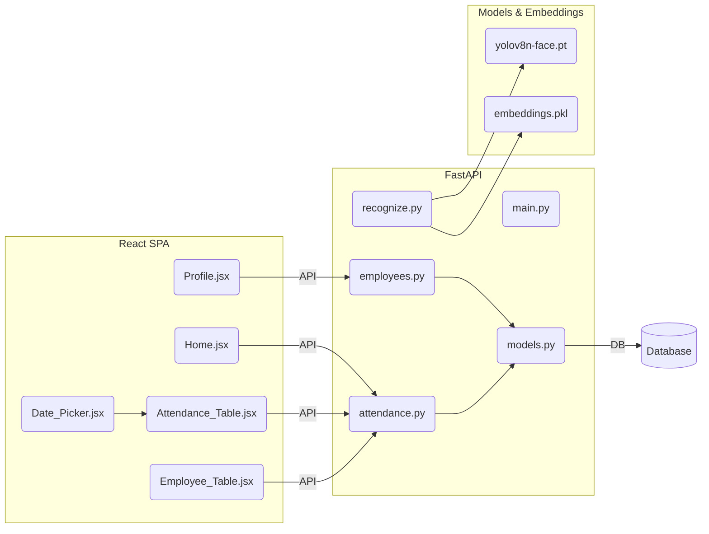
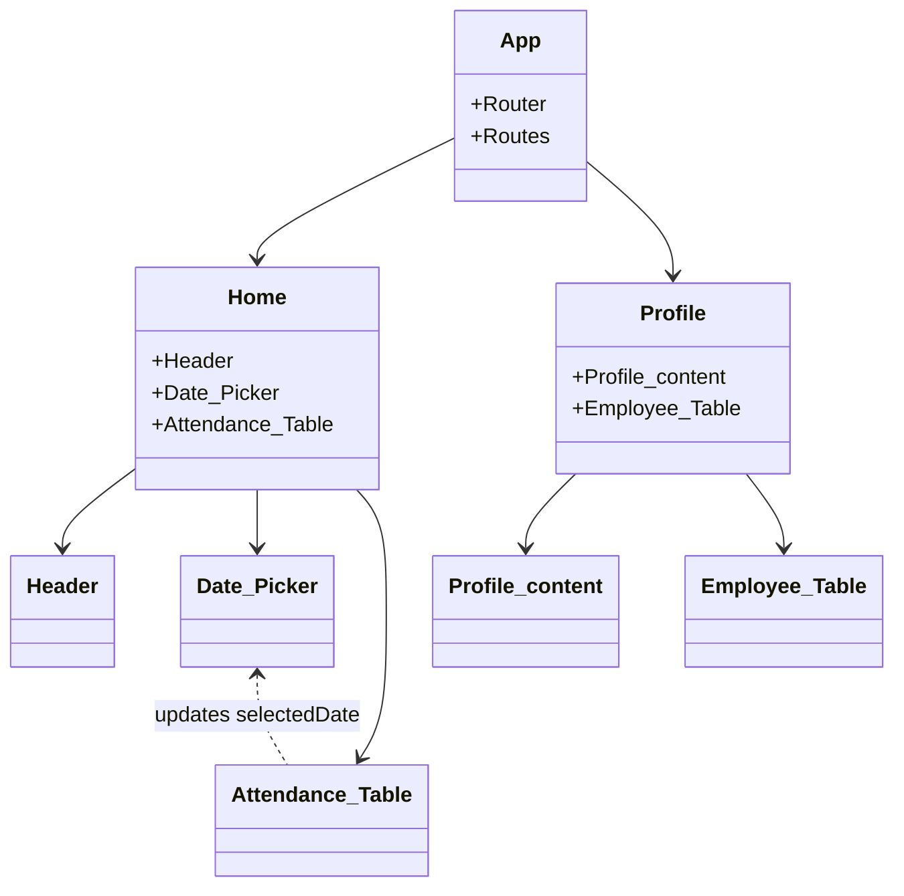
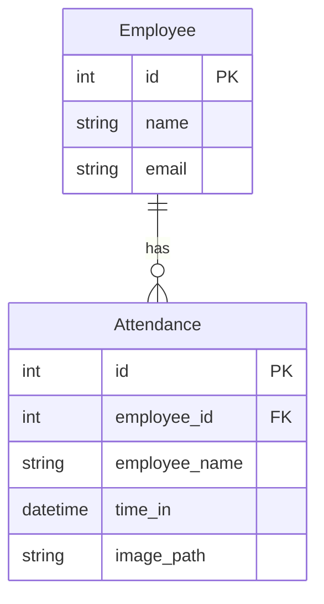

# Face Recognition Attendance Management System

This project is a **full-stack attendance tracking platform** that leverages facial recognition for secure, convenient, and automated employee attendance logging. It is composed of a robust **FastAPI backend** (with deep learning-powered face recognition) and a modern **React frontend** (styled with Tailwind CSS), designed to provide a seamless user experience for both employees and administrators.

---

## ✨ Project Highlights

- **Face Recognition:** Uses deep learning (YOLOv8, FaceNet) for real-time, robust face detection and recognition.
- **Modern SPA Frontend:** Intuitive dashboard, interactive profile pages, and dynamic data visualization using React.
- **RESTful API Backend:** Well-documented FastAPI endpoints for all attendance and employee management operations.
- **Database-Driven:** SQLAlchemy ORM models for storing employees and attendance records.
- **Production-Ready:** Modular structure, environment-based config, and scripts/utilities for dataset and model management.

---

## 🏗️ Project Structure

| Folder/File             | Description                                                         |
|-------------------------|---------------------------------------------------------------------|
| `backend/`              | FastAPI backend, facial recognition pipeline, DB models, and scripts|
| `frontend/`             | React SPA, component-based UI, API logic, and styles                |
| `README.md`             | Main project documentation (you are here)                           |
| `requirements.txt`      | Backend Python dependencies                                         |
| `.env`                  | Environment variables (DB credentials, etc.)                        |
| `assets/`               | Model weights, pickled embeddings, and face datasets                |

---

## 🚦 Quick Start

### 1. **Clone the repository**
```bash
git clone https://github.com/yourorg/attendance-face-recognition.git
cd attendance-face-recognition
```
### 2. **Setup the Backend**
```bash
cd backend
pip install -r requirements.txt
cp .env.example .env  # Edit DATABASE_URL as needed
python create_db.py   # Initialize database
python fix_dataset_faces.py  # (Optional) Clean/crop dataset
python generate_embeddings.py  # (Optional) Extract embeddings from dataset
uvicorn main:app --reload --host 0.0.0.0 --port 8000
```
### 3. **Setup the Frontend**
```bash
cd ../frontend
npm install
npm run dev
```
The frontend will run at `http://localhost:5173` (or as configured by Vite).

---

## 🧩 System Architecture Overview



---

## 🧠 Face Recognition Pipeline

- **Detection:** YOLOv8 locates faces in images.
- **Preprocessing:** Images enhanced via CLAHE, denoise, gamma correction.
- **Embedding Extraction:** FaceNet (PyTorch) encodes faces into 512-d vectors.
- **Recognition:** FAISS nearest neighbor search matches faces against known embeddings in `embeddings.pkl`.

---

## 🔌 API Endpoints

Below are the main endpoints used by the frontend (see backend README for full details):

### Get Attendance by Date

```api
{
    "title": "Get Attendance by Date",
    "description": "Fetches attendance records for all employees on a specific date.",
    "method": "GET",
    "baseUrl": "http://127.0.0.1:8000",
    "endpoint": "/attendance/by-date/:date",
    "pathParams": [
        {
            "key": "date",
            "value": "The date for which to fetch attendance (YYYY-MM-DD)",
            "required": true
        }
    ],
    "bodyType": "none",
    "requestBody": "",
    "responses": {
        "200": {
            "description": "Attendance records for the date",
            "body": "[{\"employee_id\": 1, \"employee_name\": \"Alice\", \"time_in\": \"2024-06-12T09:12:00Z\"}]"
        },
        "404": {
            "description": "No records found",
            "body": "{ \"detail\": \"No attendance records found for this date.\" }"
        }
    }
}
```

### Get Attendance by Employee

```api
{
    "title": "Get Attendance by Employee",
    "description": "Fetches all attendance records for a specific employee.",
    "method": "GET",
    "baseUrl": "http://127.0.0.1:8000",
    "endpoint": "/attendance/employee/:employeeId",
    "pathParams": [
        {
            "key": "employeeId",
            "value": "The unique ID of the employee",
            "required": true
        }
    ],
    "bodyType": "none",
    "requestBody": "",
    "responses": {
        "200": {
            "description": "Attendance records for employee",
            "body": "[{\"employee_id\": 1, \"employee_name\": \"Alice\", \"image_path\": \"/images/alice.jpg\", \"time_in\": \"2024-06-12T09:12:00Z\"}]"
        },
        "404": {
            "description": "Employee not found",
            "body": "{ \"detail\": \"No records found for this employee.\" }"
        }
    }
}
```

> **For detailed endpoint documentation, see the backend [README.md](backend/README.md).**

---

## 🖥️ Frontend Overview

- **Home Page:**  
  - Date picker for selecting the attendance date.
  - Table of all employees' attendance for the chosen date.
  - Clickable rows to view individual employee profiles.

- **Profile Page:**  
  - Employee's photo, name, and ID.
  - Table of all attendance records for this employee.

- **Styling:**  
  - Tailwind CSS for responsive, modern UI.
  - Custom CSS for layout polish.

- **API Layer:**  
  - All requests use a central Axios instance (`api.js`) for maintainability.



---

## 🗄️ Database Schema



---

## 🛠️ Utilities & Scripts

- **generate_embeddings.py:** Extracts and saves face embeddings.
- **fix_dataset_faces.py:** Auto-crops and cleans all dataset faces.
- **process_in_place.py:** Mass image enhancement for the dataset.
- **super_resolution.py:** Upscales low-res images for better recognition.
- **webcam_client.py:** CLI for real-time registration/recognition via webcam.

---

```card
{
    "title": "Model Files & Security",
    "content": "Never commit model weights or .env credentials. Always use .env for secrets and assets/ for models."
}
```

---

## ⚡ Developer Notes

- **Extendable:** Add new biometric modules, analytics endpoints, or UI features without breaking existing flows.
- **Error Handling:** Both backend and frontend provide clear error messages and robust input validation.
- **Separation of Concerns:** API logic and UI layers are strictly separated for better maintainability.

---

## 💡 Troubleshooting

- **Backend connection issues:** Double-check `.env` and DB server.
- **Model missing errors:** Ensure all files in `assets/` are present and accessible.
- **Unrecognized faces:** Dataset quality may be inadequate; try re-generating embeddings.

---

## 🎯 Key Takeaways

- **Accurate, real-time attendance via face recognition**
- **User-friendly dashboards and profile management**
- **Easy to install, extend, and maintain**
- **Modular, modern, and secure architecture**

---

For full API details and advanced configuration, see the subsystem-specific [backend](Backend/README.md) and [frontend](frontend/README.md) documentation.  
This project is ready for production deployment or research extension—**build your next-gen attendance solution today!**
