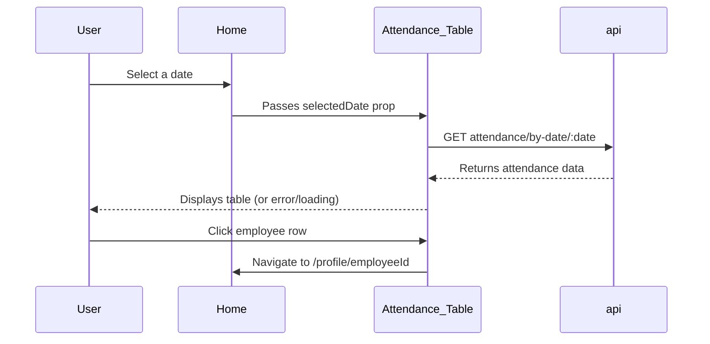
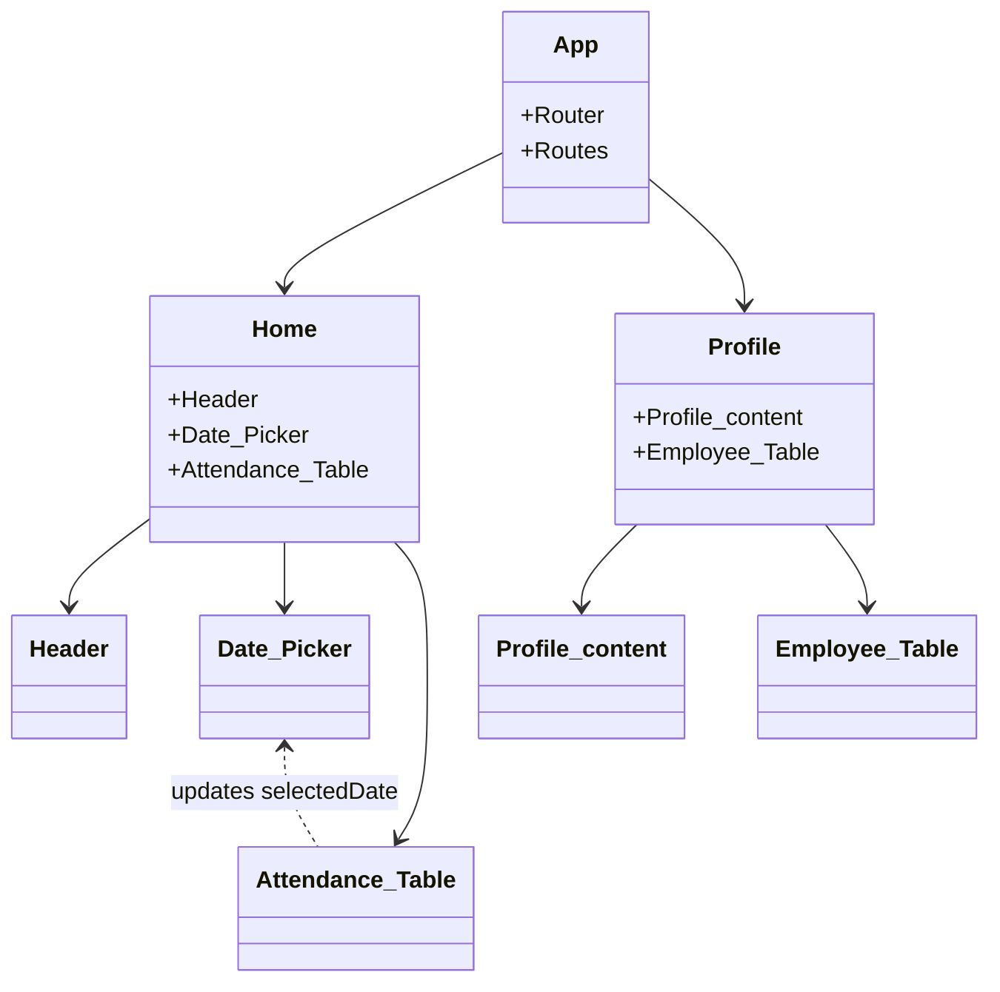

# Attendance Management System Frontend Documentation

This documentation explains the structure, styling, and logic of the Attendance Management System frontend. The code is a modern React SPA utilizing Tailwind CSS for styling and Axios for API requests. The focus is on employee attendance, with user-friendly navigation and dynamic data fetching.

---

## index.html

This file serves as the entry point for the React application. It provides the base HTML structure and links to the main JavaScript bundle.

- **Defines the root container** (`<div id="root"></div>`) for React rendering.
- Sets up metadata, favicon, and responsive viewport.
- Loads the React application from `/src/main.jsx`.

```html
<!doctype html>
<html lang="en">
<head>
  <meta charset="UTF-8" />
  <link rel="icon" type="image/svg+xml" href="/vite.svg" />
  <meta name="viewport" content="width=device-width, initial-scale=1.0" />
  <title>Attendance Tracker</title>
</head>
<body>
  <div id="root"></div>
  <script type="module" src="/src/main.jsx"></script>
</body>
</html>
```

---

## main.jsx

This file bootstraps the React application. It renders the root `<App />` component inside the HTML's `#root` div.

- Uses React’s `StrictMode` for highlighting potential problems.
- Imports global CSS and the App component.

```js
import { StrictMode } from 'react'
import { createRoot } from 'react-dom/client'
import './index.css'
import App from './App.jsx'

createRoot(document.getElementById('root')).render(
  <StrictMode>
    <App />
  </StrictMode>,
)
```

---

## App.jsx

This is the main application component that defines all the routes using React Router.

- Sets up two main routes:
  - `/` renders the `Home` page.
  - `/profile/:employeeId` renders the `Profile` page for a specific employee.

```js
import { useState, useEffect } from 'react';
import './App.css';
import { BrowserRouter as Router, Route, Routes, Link } from 'react-router-dom';
import Profile from './components/Profile';
import Home from './components/Home';

function App() {
  return (
    <Router>
      <div>
        <Routes>
          <Route path="/" element={<Home />} />
          <Route path="/profile/:employeeId" element={<Profile />} />
        </Routes>
      </div>
    </Router>
  );
}

export default App;
```

## api.js

This module sets up and exports an Axios instance for communicating with the backend API.

- **Base URL:** `http://127.0.0.1:8000`
- All API requests use this instance for consistent configuration.

```js
import axios from 'axios';
// Create an instance of axios with the base URL
const api = axios.create({ baseURL: "http://127.0.0.1:8000" });
// Export the Axios instance
export default api;
```

---

## index.css

This file contains global CSS styles and imports Tailwind CSS for utility classes.

- Sets the font, background, and color scheme.
- Styles the body, anchor tags, and root variables.
- Applies a background image and supports both light and dark color schemes.

```css
@import "tailwindcss";
:root {
  font-family: system-ui, Avenir, Helvetica, Arial, sans-serif;
  line-height: 1.5;
  font-weight: 400;
  background-image: url('/bg.jpg');
  background-size: cover;
  color-scheme: light dark;
  color: rgba(0, 0, 0, 0.87);
  background-color: #e0e0e0;
  font-synthesis: none;
  text-rendering: optimizeLegibility;
  -webkit-font-smoothing: antialiased;
  -moz-osx-font-smoothing: grayscale;
}
a {
  font-weight: 500;
  color: #646cff;
  text-decoration: inherit;
}
a:hover {
  color: #535bf2;
}
body {
  margin: 0;
  display: flex;
  min-width: 320px;
  min-height: 100vh;
}
```

---

## App.css

This stylesheet targets the root container for basic layout and color.

- Centers content, limits max width, and applies padding.
- Sets the default text color to `aliceblue` for better contrast on dark backgrounds.

```css
#root { 
  max-width: 1280px; 
  margin: 0 auto; 
  padding: 2rem; 
  text-align: center; 
  color: aliceblue; 
}
```

---

## Home.jsx

This component serves as the dashboard of the application.

- Displays the header, date picker, and attendance table.
- Manages the currently selected date.

```js
import React, { useState } from 'react'
import Header from './Header'
import Date_Picker from './Date_Picker'
import Attendance_Table from './Attendance_Table'

function Home() {
  const today = new Date().toISOString().split('T')[0];
  const [selectedDate, setSelectedDate] = useState(today);

  return (
    <div>
      <Header />
      <Date_Picker selectedDate={selectedDate} onDateChange={setSelectedDate} />
      <Attendance_Table selectedDate={selectedDate} />
    </div>
  )
}
export default Home
```

---

## Header.jsx

Displays the application title prominently at the top of the page.

```js
import React from 'react'

function Header() {
  return (
    <div className="place-items-start font-bold text-4xl top-0">
      Attendance Management System
    </div>
  )
}
export default Header
```

---

## Date_Picker.jsx

A reusable component for selecting a date.

- Prevents selection of future dates.
- Calls `onDateChange` when the user picks a new date.
- Displays the currently selected date.

```js
import React, { useCallback } from 'react'

function Date_Picker({ selectedDate, onDateChange }) {
  const handleDateChange = useCallback((e) => {
    const newDate = e.target.value;
    if (newDate !== selectedDate) {
      onDateChange(newDate);
    }
  }, [selectedDate, onDateChange]);

  return (
    <div className="flex flex-col items-center mt-6">
      <label className="mb-2 text-lg font-medium">Select a Date:</label>
      <input
        type="date"
        value={selectedDate}
        onChange={handleDateChange}
        className="border border-gray-300 p-2 rounded-md shadow-sm"
        max={new Date().toISOString().split('T')[0]} // Prevent selecting future dates
      />
      {selectedDate && (
        <p className="mt-4 text-gray-400">You selected: {selectedDate}</p>
      )}
    </div>
  )
}
export default React.memo(Date_Picker);
```

---

## Attendance_Table.jsx

Displays attendance records for all employees on the selected date.

- Fetches data via API when the date changes.
- Handles loading and error states.
- Clicking a row navigates to that employee's profile.

```js
import React, { useEffect, useState, useCallback } from 'react';
import api from '../api';
import { useNavigate } from 'react-router-dom';

function Attendance_Table({ selectedDate }) {
  const [attendanceData, setAttendanceData] = useState([]);
  const [loading, setLoading] = useState(false);
  const [error, setError] = useState(null);
  const navigate = useNavigate();

  const fetchData = useCallback(async (date) => {
    if (!date) return;
    setLoading(true);
    setError(null);
    try {
      const res = await api.get(`attendance/by-date/${date}`);
      setAttendanceData(res.data);
    } catch (error) {
      console.error('Error details:', {
        message: error.message,
        response: error.response?.data,
        status: error.response?.status
      });
      setError(error.response?.data?.detail || 'Failed to fetch attendance or employee data');
      setAttendanceData([]);
    } finally {
      setLoading(false);
    }
  }, []);

  useEffect(() => {
    const timeoutId = setTimeout(() => {
      fetchData(selectedDate);
    }, 300); // Add a small delay to prevent rapid API calls
    return () => clearTimeout(timeoutId);
  }, [selectedDate, fetchData]);

  const formatTime = useCallback((timeString) => {
    if (!timeString) return '';
    try {
      const date = new Date(timeString);
      return date.toLocaleTimeString('en-US', { hour: '2-digit', minute: '2-digit', hour12: true });
    } catch (error) {
      console.error('Error formatting time:', error);
      return timeString;
    }
  }, []);

  if (!selectedDate) {
    return (
      <div className="p-6 text-center text-gray-700">
        Please select a date to view attendance records
      </div>
    );
  }

  return (
    <div className="p-6">
      <h2 className="text-xl font-bold mt-6 mb-4">Attendance for {selectedDate}</h2>
      {loading ? (
        <div className="text-center py-4">
          <div className="inline-block animate-spin rounded-full h-8 w-8 border-b-2 border-gray-900"></div>
          <p className="mt-2">Loading attendance data...</p>
        </div>
      ) : error ? (
        <div className="text-center py-4">
          <p className="text-red-500">{error}</p>
          <p className="text-sm text-gray-700 mt-2">Please try selecting a different date</p>
        </div>
      ) : (
        <table className="min-w-full border border-gray-300">
          <thead className="">
            <tr>
              <th className="border px-4 py-2">Sr. No</th>
              <th className="border px-4 py-2">Employee ID</th>
              <th className="border px-4 py-2">Name</th>
              <th className="border px-4 py-2">Time In</th>
            </tr>
          </thead>
          <tbody>
            {attendanceData.length > 0 ? (
              attendanceData.map((entry, index) => (
                <tr key={index} className="text-center hover:bg-gray-600" onClick={() => navigate(`/profile/${entry.employee_id}`)}>
                  <td className="border px-4 py-2">{index + 1}</td>
                  <td className="border px-4 py-2"> {entry.employee_id} </td>
                  <td className="border px-4 py-2">{entry.employee_name}</td>
                  <td className="border px-4 py-2"> {formatTime(entry.time_in)} </td>
                </tr>
              ))
            ) : (
              <tr>
                <td colSpan="4" className="text-center py-4">No attendance records found for this date.</td>
              </tr>
            )}
          </tbody>
        </table>
      )}
    </div>
  );
}
export default React.memo(Attendance_Table);
```

### Attendance Data Flow



---

## Profile.jsx

This page shows detailed information and attendance records for a specific employee.

- Uses the URL parameter to fetch data for the correct employee.
- Includes both the employee profile and their attendance table.

```js
import React from 'react'
import Employee_Table from './Employee_Table';
import Profile_content from './Profile_content';
import { useParams } from 'react-router-dom';

function Profile() {
  const { employeeId } = useParams();
  return (
    <div>
      <Profile_content employeeId={employeeId}/>
      <Employee_Table employeeId={employeeId} />
    </div>
  );
}
export default Profile
```

---

## Profile_content.jsx

Fetches and displays profile information for a specific employee.

- Fetches data from the backend using the employee ID.
- Shows the employee's name, ID, and profile picture.
- Handles loading and "not found" states gracefully.

```js
import React, { useState, useEffect } from 'react';
import api from '../api';

function Profile_content({ employeeId }) {
  const [profile, setProfile] = useState(null);
  const [loading, setLoading] = useState(true);

  useEffect(() => {
    if (!employeeId) return;
    const fetchProfile = async () => {
      setLoading(true);
      try {
        // Fetch employee profile by ID
        const res = await api.get(`attendance/employee/${employeeId}`);
        // Assuming res.data is an array with at least one object
        if (res.data.length > 0) {
          const { employee_name, employee_id, image_path } = res.data[0];
          setProfile({
            name: employee_name,
            id: employee_id,
            image: image_path,
          });
        } else {
          setProfile(null);
        }
      } catch (error) {
        console.error('Error fetching employee profile:', error);
        setProfile(null);
      } finally {
        setLoading(false);
      }
    };
    fetchProfile();
  }, [employeeId]);

  if (loading) {
    return <div className="p-4">Loading profile...</div>;
  }
  if (!profile) {
    return <div className="p-4">No profile found for employee ID: {employeeId}</div>;
  }

  return (
    <div className="p-4 flex flex-col items-center space-y-4">
      
      <h2 className="text-2xl font-bold">{profile.name}</h2>
      <p className="text-gray-400 text-lg">Employee ID: {profile.id}</p>
    </div>
  );
}
export default Profile_content;
```

---

## Employee_Table.jsx

Displays all attendance records for a specific employee.

- Fetches attendance data using the employee ID.
- Lists the date, day, and time in for each record.

```js
import React, { useEffect, useState } from 'react';
import api from '../api';

function Employee_Table({ employeeId }) {
  const [attendanceData, setAttendanceData] = useState([]);

  useEffect(() => {
    if (!employeeId || isNaN(employeeId)) {
      console.error("Invalid employeeId:", employeeId);
      return; // skip fetch if invalid
    }
    const fetchAttendance = async () => {
      try {
        const res = await api.get(`attendance/employee/${ employeeId }`);
        setAttendanceData(res.data);
      } catch (error) {
        console.error('Failed to fetch attendance:', error);
      }
    };
    fetchAttendance();
  }, [employeeId]);

  return (
    <div className="p-4 text-white bg-">
      <h2 className="text-xl font-bold mb-4">Employee Attendance Records</h2>
      <table className="min-w-full border border-gray-300">
        <thead>
          <tr>
            <th className="border px-4 py-2">Sr. No</th>
            <th className="border px-4 py-2">Day & Date</th>
            <th className="border px-4 py-2">Time In</th>
          </tr>
        </thead>
        <tbody>
          {attendanceData.map((entry, index) => {
            const dateObj = new Date(entry.time_in);
            const day = dateObj.toLocaleDateString('en-US', { weekday: 'long' });
            const date = dateObj.toLocaleDateString();
            const time = dateObj.toLocaleTimeString();
            return (
              <tr key={index} className="hover:bg-gray-600">
                <td className="border px-4 py-2">{index + 1}</td>
                <td className="border px-4 py-2">{`${day}, ${date}`}</td>
                <td className="border px-4 py-2">{time}</td>
              </tr>
            );
          })}
        </tbody>
      </table>
    </div>
  );
}
export default Employee_Table;
```

---

## API Endpoints Used

The frontend interacts with the following API endpoints:

### Get Attendance by Date

```api
{
  "title": "Get Attendance by Date",
  "description": "Fetches attendance records for all employees on a specific date.",
  "method": "GET",
  "baseUrl": "http://127.0.0.1:8000",
  "endpoint": "/attendance/by-date/:date",
  "headers": [],
  "queryParams": [],
  "pathParams": [
    {
      "key": "date",
      "value": "The date for which to fetch attendance (YYYY-MM-DD)",
      "required": true
    }
  ],
  "bodyType": "none",
  "requestBody": "",
  "responses": {
    "200": {
      "description": "Attendance records for the date",
      "body": "[{\"employee_id\": 1, \"employee_name\": \"Alice\", \"time_in\": \"2024-06-12T09:12:00Z\"}]"
    },
    "404": {
      "description": "No records found",
      "body": "{ \"detail\": \"No attendance records found for this date.\" }"
    }
  }
}
```

### Get Attendance by Employee

```api
{
  "title": "Get Attendance by Employee",
  "description": "Fetches all attendance records for a specific employee.",
  "method": "GET",
  "baseUrl": "http://127.0.0.1:8000",
  "endpoint": "/attendance/employee/:employeeId",
  "headers": [],
  "queryParams": [],
  "pathParams": [
    {
      "key": "employeeId",
      "value": "The unique ID of the employee",
      "required": true
    }
  ],
  "bodyType": "none",
  "requestBody": "",
  "responses": {
    "200": {
      "description": "Attendance records for employee",
      "body": "[{\"employee_id\": 1, \"employee_name\": \"Alice\", \"image_path\": \"/images/alice.jpg\", \"time_in\": \"2024-06-12T09:12:00Z\"}]"
    },
    "404": {
      "description": "Employee not found",
      "body": "{ \"detail\": \"No records found for this employee.\" }"
    }
  }
}
```

---

## Component Relationship Overview



---

```card
{
  "title": "API and UI Separation",
  "content": "All data fetching is handled via the api.js Axios instance. UI components remain clean and focused on presentation and state."
}
```

---

## Key Takeaways

- The frontend is cleanly organized using modular React components.
- Styling leverages Tailwind CSS and some custom CSS.
- API requests are abstracted with Axios, making code reusable and consistent.
- Navigation is smooth with React Router, allowing per-employee and per-date views.
- Components handle loading and error states gracefully for a robust user experience.

---

For further information, see the code comments and explore each component to understand how data flows through the app. This structure makes it easy to extend and maintain the Attendance Management System frontend.
